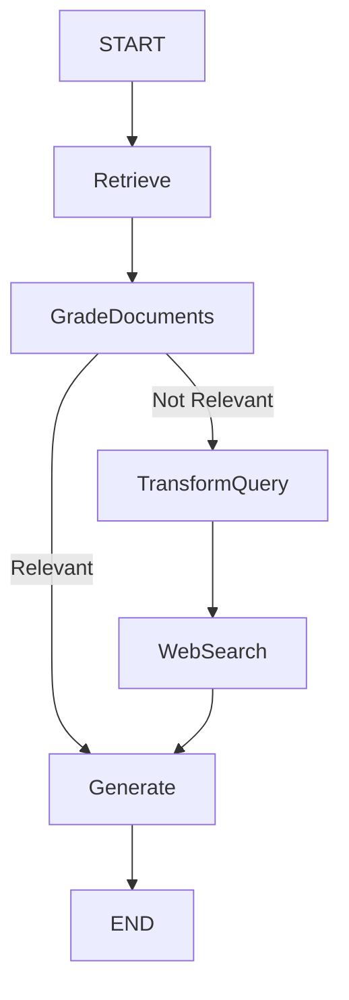

# Corrective_RAG_systems

# Corrective RAG (Retrieval-Augmented Generation with Relevance Grading)

This project implements a **Corrective RAG pipeline** using [LangChain](https://www.langchain.com/), integrating **Google Generative AI**, **OpenAI GPT-4o**, **HuggingFace embeddings**, and **Tavily search** for improved document retrieval and answer generation.

The pipeline not only retrieves documents and generates answers but also includes **grading**, **query rewriting**, and **web search augmentation** when retrieved documents are not relevant.

---

## 🔹 Features

* ✅ **Retriever**: Splits documents and stores them in a vector database (Chroma).
* ✅ **Relevance Grader**: Uses an LLM to check if retrieved documents are relevant.
* ✅ **Query Rewriter**: Rewrites poorly phrased user queries into more effective ones.
* ✅ **Corrective Workflow**: If documents are irrelevant, the system rewrites the query and performs a **web search**.
* ✅ **Graph Workflow**: Orchestrated using `langgraph` to define state transitions.

---

## 🛠️ Tech Stack

* **LLMs**:

  * Google Generative AI (`gemini-embedding-001`) for embeddings
  * OpenAI GPT-4o for reasoning & generation
* **Vector DB**: [Chroma](https://www.trychroma.com/)
* **Embeddings**: HuggingFace & Google Generative AI
* **Workflow Engine**: LangGraph
* **Search API**: [Tavily](https://tavily.com/) (for corrective web search)
* **Visualization**: Mermaid & Matplotlib

---

## 📦 Installation

Clone the repo and install dependencies:

```bash
git clone https://github.com/yourusername/corrective-rag.git
cd corrective-rag
pip install -r requirements.txt
```

### Requirements (`requirements.txt`)

```txt
langchain
langchain-core
langchain-community
langchain-google-genai
langchain-openai
langgraph
chromadb
tiktoken
matplotlib
pydantic
```

---

## ⚙️ Setup

You’ll need API keys for:

* **OpenAI** → `OPENAI_API_KEY`
* **Google Generative AI** → `GOOGLE_API_KEY`
* **Tavily** → `TAVILY_API_KEY`

Set them as environment variables:

```bash
export OPENAI_API_KEY="your-openai-key"
export GOOGLE_API_KEY="your-google-key"
export TAVILY_API_KEY="your-tavily-key"
```

Or replace directly in the code (not recommended for production).

---

## 🚀 Usage

### 1. Run a simple LLM test

```python
result = llm.invoke("Write a poem about Ranil Wickramasinghe")
print(result.content)
```

### 2. Build Retriever

* Load documents from Lilian Weng’s AI blog posts
* Split into chunks
* Store in Chroma VectorDB

### 3. RAG Pipeline

```python
question = "tell me about agent memory."
generation = rag_chain.invoke({"context": doc_splits, "question": question})
print(generation)
```

### 4. Corrective Workflow

* Retrieves relevant docs
* Grades them → filters irrelevant ones
* If irrelevant → rewrites query + performs Tavily web search
* Generates final answer

```python
inputs = {"question": "tell me about the Taj Mahal."}
for output in app.stream(inputs):
    print(output)
```

---

## 📊 Workflow Graph

The pipeline is managed via `langgraph` as a **state graph**:



---

## 🔎 Known Issues

* **Tavily API Key**: You must have a valid Tavily API key; otherwise, web search step fails.
* **Dependencies**: Ensure versions of `langchain` and `langgraph` are compatible.

---

## 📌 Roadmap

* [ ] Add support for PDF/CSV/Docs as input sources
* [ ] Improve query rewriting with reinforcement signals
* [ ] Deploy as a web app with Streamlit/Gradio
* [ ] Cache vector store for efficiency

---

## 🤝 Contributing

Pull requests are welcome! For major changes, please open an issue first to discuss what you’d like to change.

---

## 📄 License

This project is licensed under the MIT License – see the [LICENSE](LICENSE) file for details.


